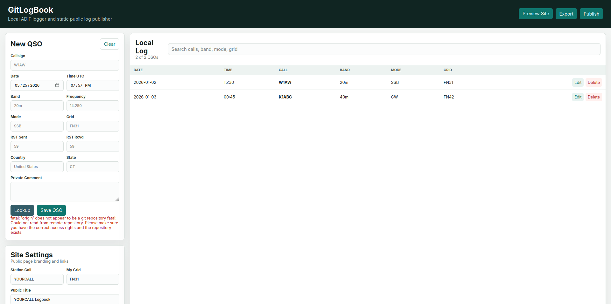
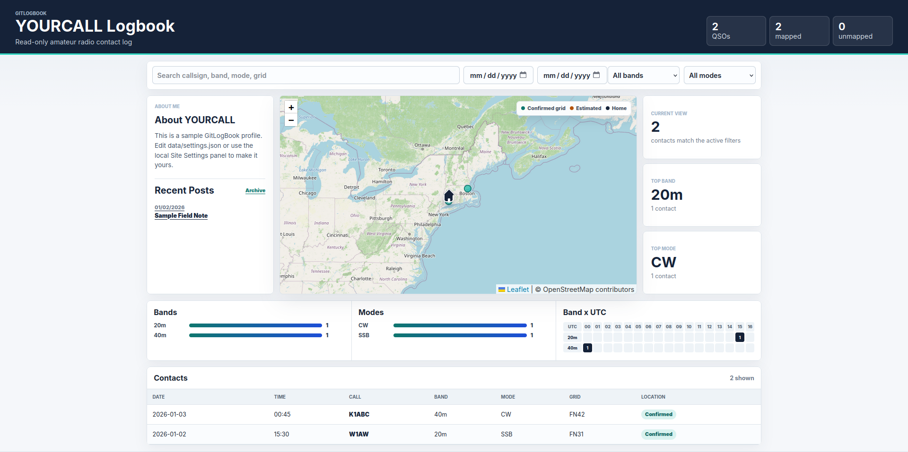
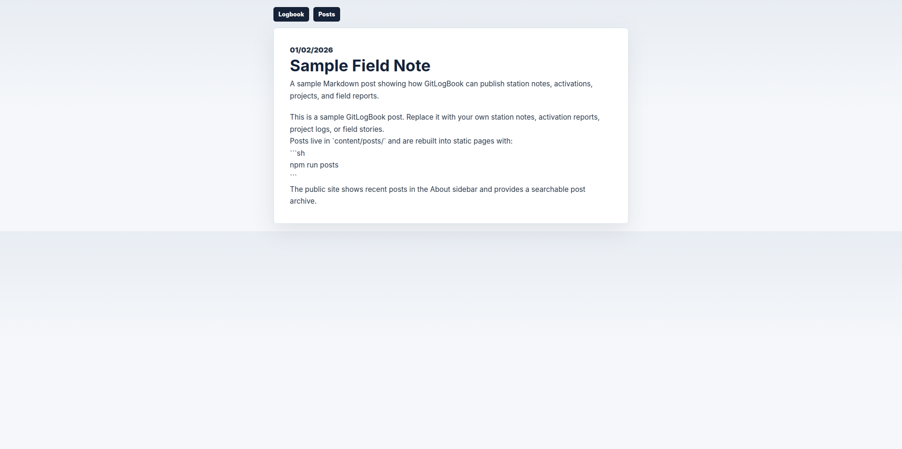

# GitLogBook

GitLogBook is a local-first amateur radio logger that stores QSOs as ADIF and publishes a read-only, searchable static logbook to GitHub Pages.

It is designed around a clear privacy boundary:

```text
private local ADIF -> sanitized public JSON -> static GitHub Pages site
```

The local app is the only writer. The public site is read-only.

## Features

- Local add, edit, and delete QSO workflow.
- ADIF source of truth with stable `APP_GITLOGBOOK_ID` values.
- ADIF import with duplicate detection.
- Optional Callook lookup for estimated U.S. location/grid data.
- Privacy-aware public export that excludes raw imported ADIF fields.
- Searchable/filterable public QSO table.
- Leaflet/OpenStreetMap contact map with confirmed, estimated, and home markers.
- Band and mode charts.
- Band x UTC heatmap.
- Configurable public profile/sidebar.
- Markdown blog/archive with searchable static post index.
- Git-based publish flow for GitHub Pages.

## Screenshots

### Local Logger



### Public Logbook



### Blog Archive



## Repository Model

For real use, split software and deployment:

```text
GitLogBook/        reusable software repo
YOURCALL-Logbook/  personal GitHub Pages deployment repo
```

The software repo contains the app, parser, exporter, templates, examples, and docs.

Your personal deployment repo contains generated `docs/`, your public posts, your public settings, and optionally a local ignored `data/logbook.adi`.

## Install

Requirements:

- Node.js 20+
- Git

Run the local app:

```sh
npm run dev
```

On Linux desktops, you can also double-click `GitLogBook.desktop` from the repo folder. If your file manager asks, choose to trust or allow launching the file.

Local logger:

```text
http://127.0.0.1:5173
```

Public site preview:

```text
http://127.0.0.1:5173/site/
```

## File Layout

```text
app/                 local logger UI
content/posts/       Markdown blog posts
data/settings.json   local/public site settings
data/logbook.adi     private local ADIF, ignored by Git
docs/                generated static GitHub Pages site
examples/            sample settings and ADIF files
lib/                 ADIF, import, export, grid utilities
scripts/             import/export/post build scripts
tests/fixtures/      small sanitized ADIF test files
```

## Configure

Edit settings in the local app under **Site Settings**, or edit:

```text
data/settings.json
```

Useful fields:

```json
{
  "stationCallsign": "YOURCALL",
  "publicTitle": "YOURCALL Logbook",
  "publicSubtitle": "Read-only amateur radio contact log",
  "aboutTitle": "About YOURCALL",
  "aboutBody": "Your public biography.",
  "profileImageUrl": "https://github.com/YOUR_USERNAME.png",
  "myGrid": "FN31"
}
```

Regenerate public files:

```sh
npm run export
```

## Import ADIF

From the local app, use the **Import ADIF** panel and paste a local `.adi` path.

From the terminal:

```sh
node scripts/import-adif.js /path/to/log.adi
```

The importer merges records, skips likely duplicates, writes `data/logbook.adi`, and regenerates the public JSON.

## Blog Posts

Create Markdown files in:

```text
content/posts/
```

Use frontmatter:

```md
---
title: "Portable CW Activation"
date: "2026-01-02"
summary: "A short field report."
tags: ["cw", "portable"]
---

Your post body here.
```

Build posts:

```sh
npm run posts
```

`npm run export` also rebuilds posts.

## Publishing

GitHub Pages should serve from:

```text
main /docs
```

The local app's **Publish** button runs:

```text
git add docs
git commit -m "Publish log update"
git push origin main
```

Only generated public files are committed by default.

## Privacy

Imported ADIF files may contain private data:

- names
- email addresses
- street addresses
- exact coordinates
- private notes
- QTH details

For that reason:

```text
data/logbook.adi
```

is ignored by Git. The public site uses sanitized generated files under:

```text
docs/data/
```

Review `docs/data/log.json` before publishing a public site.

## Examples

Sample settings:

```text
examples/sample-settings.json
```

Sample ADIF:

```text
examples/sample-logbook.adi
```

Sanitized import fixture:

```text
tests/fixtures/sample-import.adi
```

## Current Limitations

- Callsign lookup is U.S.-focused through Callook.
- Visitor write access is intentionally unsupported.
- The local app uses a simple Node server, not packaged desktop binaries.
- The Git publish workflow assumes a local Git repo and remote are already configured.

## Roadmap

- Better publish status and remote setup.
- Import history.
- Public field/privacy controls.
- Post creation templates.
- Optional deployment-target repo setting.
- More robust ADIF validation and conflict handling.
